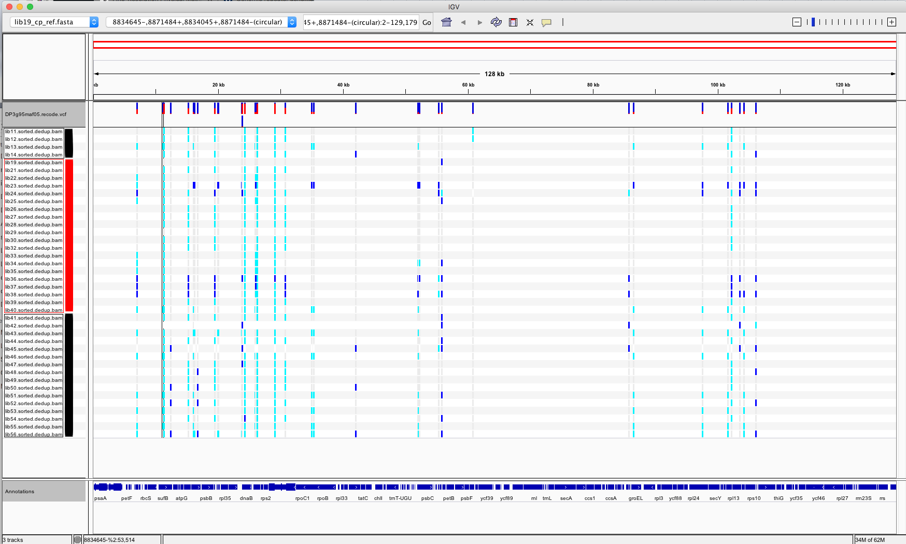

# cp_genome_assembly_and_variant_calling

## background
It is currently unclear how much chloroplast genome sequence varies among and within <i>T. rotula</i> isolates collected in two distanct sampling localities. We are currently considering lcWGS of co-cultures and would like to know approximately how many polymorphic sites to expect among closely related isolates, so that we can assess whether we will have enough information to deconvolute competing co-cultures in our lineage sorting experiment.

## methods
In this pipeline, I applied getOrganelle, Bandage and CHLOROBOX GeSeq to assembly, circularize and annotate a draft plastid genome, respectively. This circularized and annotated reference genome (isolate lib19 - South African origin) was then used to align quality-filtered short reads from 40 different <i>T. rotula</i> isolates and to call SNVs and short indels among individuals (applying bwa-mem, samtools, bamaggr, picardTools, and bayescan). Raw SNVs were filtered for depth, call rate and quality, and no individuals were removed for excess missing genotype data. Lastly, the filtered vcf file, reference fasta and annotation file were manually combined in IGV for easy viewing of the distribution of SNVs across and within two sampling localities (NB:11-14,41-56; SA:19,21-30,32-40).

## results
Overall, our 128kb de novo plastid assembly contained an estimated 50 variant sites among the 40 isolates examined here. Given that we're working with plastid genomes, all variants are assumed to be in full LD. Initial viewing suggests that there are many unique haplotypes within each population. Nearly all polymorphic loci are found in coding sequence (not sure yet what the synonymous/nonsynonymous ratio is).

<b>Figure 1.</b> IGV browser screenshot of all 40 haplotypes and annotated coding sequence. Each grey/lightblue/darkblue marker indicates a SNP locus (grey=homozygous for ref allele, lightblue=homozygous for alt allele, and darkblue=heterozygous). Samples left of the black bars are from Narragansett Bay, samples left of the red bar are from South Africa.

## conclusions
My initial conclusions are that there is plenty of genetic diversity upon which deconvolution presence/absence analyses can be based, even among single cell isolates collected from the same water sample. If lcWGS genotyping only gave us sufficient coverage at high-copy number regions like rRNA, plastid and mitochondiral genomes, these results suggest that potentially hundreds of high depth segregating markers could be available for use (they are segregating in this case because we assume no mutation during the experiment). It is even possible that knowing <i>a priori</i> which variants belong to which strain (by sequencing them separately at higher coverage) is not strictly necessary, if our primary goal is to identify when one of the two genotypes goes extinct in each co-culture. If we have monocultures in the evolution plate as well, it is even more likely that we do not need any separate founder strain sequencing at higher coverage.

